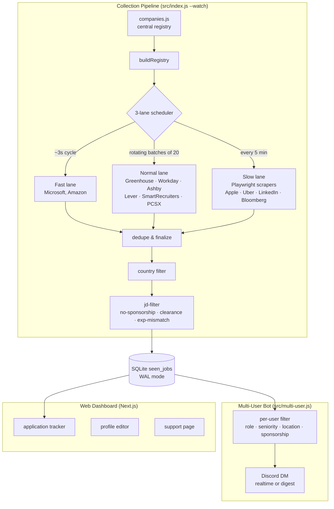

# JobPulse

Real-time multi-user job aggregation platform. Monitors 120+ companies across 8 integration types and delivers personalized job alerts via Discord DM within minutes of posting.

> **6,000+** jobs tracked &middot; **3,900+** personalized DMs delivered &middot; **900+** applications in user trackers &middot; Running 24/7 on AWS EC2 since March 2026

---

## Features

### Discord Bot

- Discord OAuth sign-up with email OTP verification
- Per-user filters: role, seniority tier, location, experience level, H1B sponsorship requirement
- Delivery modes: realtime DM or digest, with user-configurable quiet hours and timezone
- Job DMs include a rich embed (title, company, location, posted date) with interactive buttons &mdash; **Applied**, **Skip**, **Save**
- Slash commands: `/search <keywords>` for cross-company keyword search, `/company <name>` for per-company browsing
- Saved-job expiry reminders

### Web Dashboard (Next.js)

- Application tracker &mdash; view, filter, and update the status of every applied / saved job
- Profile editor for delivery preferences and filters
- Support page &mdash; submit bug reports, missing-jobs reports, and feature requests; suggest companies to add; track ticket status and admin responses

### Ops

- SQLite-backed deduplication (WAL mode) across all collectors
- H1B-sponsor filtering from an LCA-derived sponsor list
- Runs 24/7 on AWS EC2 under `pm2` with auto-restart

---

## Architecture



Each ATS platform has a dedicated collector in `src/sources/` returning a standardized job shape; `src/companies.js` is the central registry every collector is derived from.

**Why three lanes?** The fast lane cycles every ~3 seconds for high-priority APIs like Microsoft and Amazon where new postings appear frequently. The normal lane rotates through standard REST / GraphQL APIs in batches of 20 to stay well under rate limits. The slow lane runs every 5 minutes for Playwright-based scrapers, sharing a single headless browser instance to amortize startup cost.

**Why SQLite with WAL mode?** Single-writer, many-reader semantics match the collection pattern exactly &mdash; one polling loop writes, two consumer services read. No external dependency, no connection pool to manage, crash-safe via write-ahead logging. 6,000+ jobs tracked with sub-millisecond dedup lookups.

**Why filter per-user at delivery, not collection?** One collection pass serves N users with different preferences. Per-user polling would scale as O(users &times; companies); this scales as O(companies) with O(users &times; jobs) delivery. That's a significant reduction in outbound API calls and keeps the system recruiter-friendly on rate limits.

---

## Tech Stack

```
Runtime    Node.js (ESM, no framework)
Data       SQLite (better-sqlite3, WAL mode)
Scraping   Playwright (shared browser), REST + GraphQL clients
Discord    discord.js (buttons, threads, slash commands, OAuth)
Web        Next.js 15 (App Router), Tailwind CSS
Infra      AWS EC2, pm2, Linux
Email      AWS SES (OTP verification)
```

---

## Supported ATS Platforms

| Integration | Companies | Method |
|---|---|---|
| Greenhouse | 36 &mdash; Stripe, Databricks, Figma, Airbnb, DoorDash, Reddit, and more | REST API |
| Workday | 25 &mdash; Nvidia, Adobe, Intel, PayPal, Samsung, Broadcom, and more | REST API |
| Ashby | 24 &mdash; OpenAI, Notion, Ramp, Snowflake, Cursor, and more | REST API |
| Lever | 14 &mdash; Palantir, Plaid, Spotify, and more | REST API |
| SmartRecruiters | 6 &mdash; ServiceNow, Visa, and more | REST API |
| PCSX | 1 &mdash; Citi-hosted PCSX board | REST API |
| Custom APIs | 12 &mdash; Microsoft, Amazon, Google, Meta, Goldman Sachs, Oracle, JPMorgan, and more | Reverse-engineered APIs |
| Custom scrapers | 6 &mdash; Apple, Uber, LinkedIn, Bloomberg, Intuit, Confluent | HTML + Playwright |

**Total: 124 companies.**

---

## Running Locally

```bash
git clone https://github.com/Parth-Sahastrabuddhe/Job-Pulse.git
cd Job-Pulse
npm install
npx playwright install --with-deps chromium
cp .env.example .env
cp web/.env.local.example web/.env.local
# Fill in the Discord bot tokens in .env, and the Discord OAuth
# credentials + AWS SES credentials in web/.env.local. See both
# example files for the full list of required variables.
```

JobPulse runs as two processes:

```bash
# Terminal 1 — collection pipeline (polls all ATS integrations, writes to SQLite)
node src/index.js --watch

# Terminal 2 — multi-user Discord bot (reads SQLite, filters per user, delivers DMs)
node src/multi-user.js
```

Production runs both under `pm2` on AWS EC2 with auto-restart. The web dashboard (`web/`) is a standalone Next.js app; see `web/README.md` for that piece.

---

## Roadmap

- Per-user resume tailoring powered by Gemini (currently single-user only; needs multi-user resume upload + per-user API keys)
- More ATS integrations from the community-submitted `/add` queue
- Mobile-responsive dashboard polish
- Public demo instance with rate-limited sign-up

---

*Built by [Parth Sahastrabuddhe](https://www.linkedin.com/in/parth-sahastrabuddhe/).*
